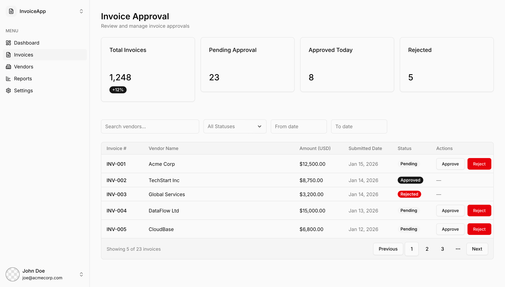
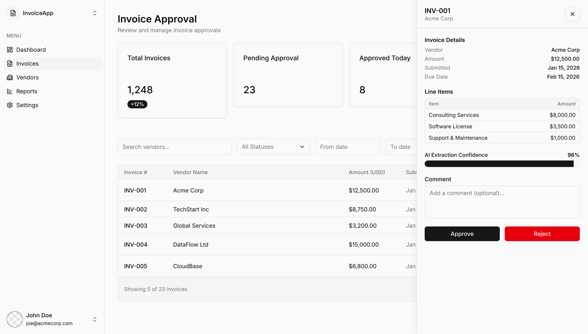

# Invoice Approval Dashboard

An MVP/proof-of-concept invoice approval dashboard built from a Pencil.dev design and exported to React + Tailwind.

## Screenshots

Main dashboard design exported from Pencil.dev:



Detail panel variant exported from Pencil.dev:



This project demonstrates a design-to-code workflow where the UI is first composed in the Pencil desktop app using the built-in Shadcn template, then translated into a working web page with a Claude/GPT model interacting through the Pencil MCP server.

## Why this exists

This dashboard is intentionally simple. The goal is not to showcase a large production app, but to prove a workflow:

- design a screen visually in Pencil.dev
- reuse existing design-system components
- generate a matching web implementation
- iterate quickly from mockup to code

It is a practical MVP and a proof of concept for how an AI-assisted design workflow can speed up UI development while preserving consistency with the source design.

## Workflow demonstrated

1. Start with the Pencil.dev Shadcn template.
2. Use the Pencil MCP server to let Claude/GPT inspect the component library.
3. Compose the dashboard in the design canvas using reusable components.
4. Verify the layout visually in Pencil.
5. Export the design intent into a React + Tailwind implementation.

This workflow allows a developer to:

- move from idea to screen much faster
- keep the implementation close to the design
- reuse component patterns instead of hand-building every UI piece repeatedly
- validate structure before writing production code
- use AI as a layout and assembly assistant instead of a guess-and-check tool

## What’s included

- top stats bar
- filter bar with status, date, and vendor search
- invoice table with status badges and action buttons
- slide-in detail side panel
- AI extraction confidence indicator
- approve/reject actions with comment box

## Tech stack

- React
- TypeScript
- Tailwind CSS
- Lucide icons
- Pencil.dev MCP workflow for design generation

## Implementation notes

- The current web implementation is intentionally centralized in `src/App.tsx` because this is a PoC.
- In a real production version, the UI should be split into modular components for reuseability and maintainability.
- The dashboard was implemented from scratch rather than using the Shadcn React library directly.
- That approach is slower and less ideal for long-term maintenance, but it was sufficient for proving the design-to-code workflow.
- If this were the next iteration, I would map the Pencil components more directly to the Shadcn React components so the implementation could be faster and more faithful to the design system.

## Project structure

```text
src/
  App.tsx        # Main dashboard implementation
  main.tsx       # React entry point
  index.css      # Tailwind theme tokens and global styles
```

## Development

Install dependencies:

```bash
npm install
```

Run locally:

```bash
npm run dev
```

Build for production:

```bash
npm run build
```

## Design files

The Pencil design artifacts used for this POC are included in the repository:

- `design.pen`
- exported screenshots in `public/screenshots/`

## Future improvements

- split `App.tsx` into reusable components
- replace handcrafted UI pieces with the actual Shadcn React library
- add real date filtering and search behavior
- connect approve/reject actions to an API
- persist selected invoice state in the URL or store
- turn the detail panel into a reusable drawer component

## Summary

This project is a compact demonstration of a modern AI-assisted product workflow: design in Pencil.dev, generate with MCP, and deliver a working React UI that closely follows the source design.
